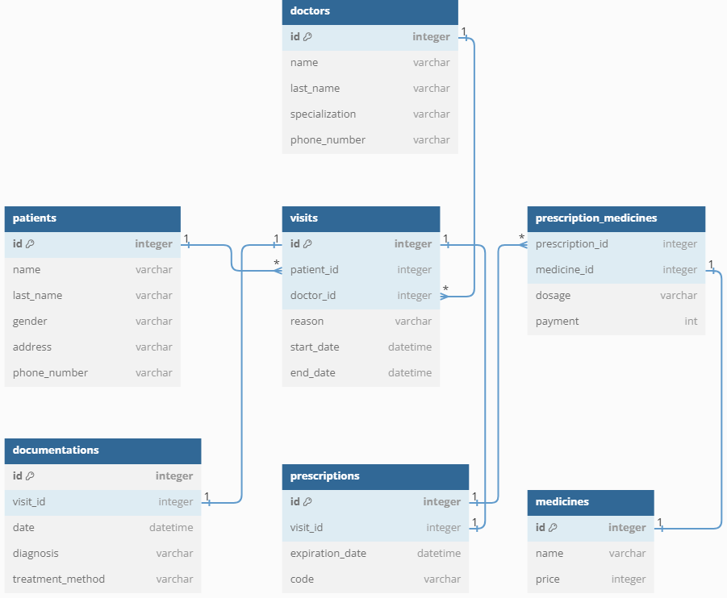
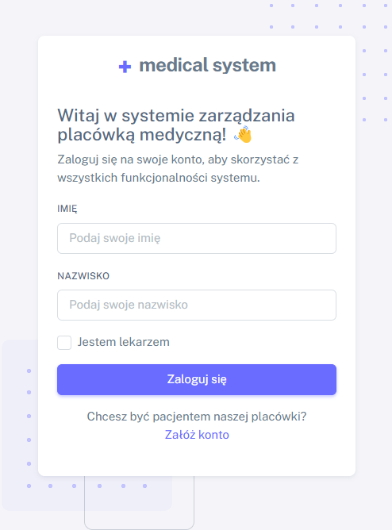
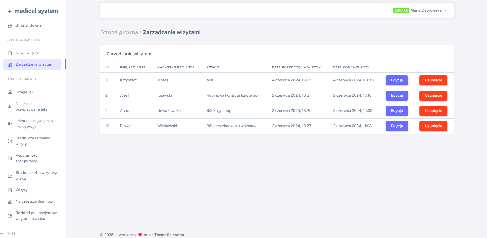
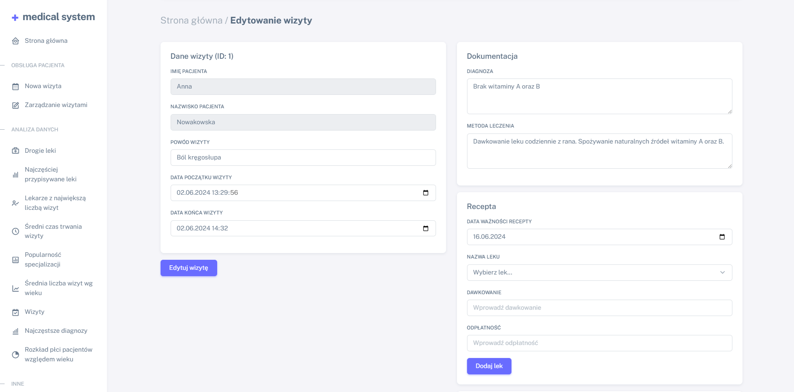
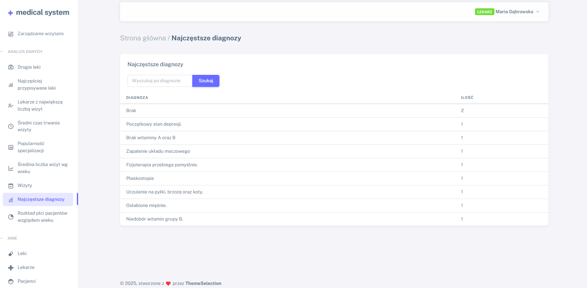
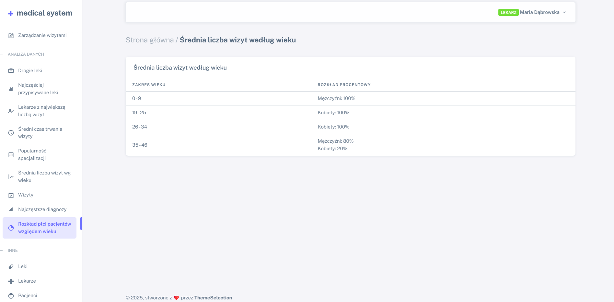

# System zarządzania placówką medyczną

Projekt zaliczeniowy laboratorium przedmiotu **"Bazy danych"**.  
Aplikacja webowa oparta na Laravelu, ilustrująca wykorzystanie funkcji i procedur PL/SQL w bazie danych Oracle.

## Opis projektu
System umożliwia zarządzanie danymi medycznymi placówki, w tym informacjami o pacjentach, lekarzach, wizytach, dokumentacji medycznej oraz receptach.  
Aplikacja wspiera operacje CRUD oraz analizę danych dzięki implementacji funkcji i procedur w bazie danych Oracle.

Pełna dokumentacja projektu znajduje się w pliku **Dokumentacja.pdf**.

## Technologie i biblioteki
- **Framework:** Laravel 11
- **Język backend:** PHP 8.2  
- **Baza danych:** Oracle 19c  
- **Frontend:** Blade, Bootstrap 5 (Sneat)
- **Narzędzia:** Docker, Composer

## Struktura bazy danych
Baza danych została zaprojektowana z myślą o przechowywaniu i przetwarzaniu danych medycznych.  
Plik `medical_system.sql` zawiera pełną strukturę bazy danych oraz procedury i funkcje PL/SQL.

### Diagram ERD

## Funkcjonalności aplikacji
- Rejestrowanie pacjentów i lekarzy  
- Zarządzanie wizytami oraz dokumentacją medyczną  
- Generowanie recept i przypisywanie leków  
- Analiza danych, m.in. statystyki wizyt, popularność specjalizacji, średni czas wizyt  
- Raportowanie najczęściej przepisywanych leków i diagnoz

## Przykładowe funkcje i procedury PL/SQL
- **`SEARCH_EXPENSIVE_MEDICINES()`** – wyszukuje najdroższe leki  
- **`CALCULATE_AVERAGE_MEDICINE_PRICE()`** – oblicza średnią cenę leków  
- **`GENERATE_TOP_DIAGNOSIS_REPORT()`** – zwraca najczęściej stawiane diagnozy  
- **`ADD_VISIT()`** – dodaje wizytę do systemu  
- **`DELETE_VISIT_AND_ASSOCIATED_DATA()`** – usuwa wizytę i powiązane z nią dane  

Pełna lista dostępna w pliku `medical_system.sql`.

## Przykładowe zrzuty ekranu

### Panel logowania

### Zarządzanie wizytami

### Statystyki i analizy

## Autorzy
Projekt wykonali [Krzysztof Motas (@krzysztofmotas)](https://github.com/krzysztofmotas) i [Patryk Jarosiewicz (@404ptk)](https://github.com/404ptk), studenci Informatyki Uniwersytetu Rzeszowskiego.

## Podsumowanie
Projekt demonstruje integrację Laravel z bazą danych Oracle oraz wykorzystanie funkcji i procedur PL/SQL.  